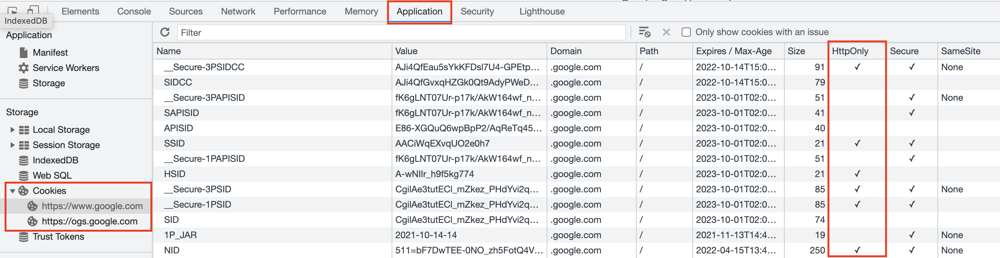
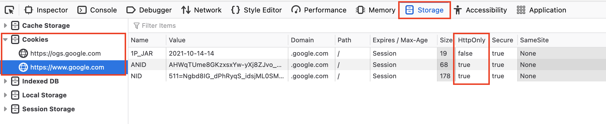

# รายละเอียด

**HTTPOnly Flag** คือ ค่าที่ใช้กำหนด cookies ให้ทำการส่งผ่าน HTTP เท่านั้น เพื่อป้องกันการทำ cross-site scripting (XXS) ซึ่งผู้ไม่ประสงค์ดีใช้งาน javascript เข้ามาขโมย cookies ของผู้ใช้งาน
*****

# การตรวจสอบ

**Google Chrome**  สามารถเข้าไปตรวจสอบว่าค่า HTTPOnly flag ถูกเปิดใช้งานหรือไม่ โดยการเปิดหน้าต่าง Developer Tools ขึ้นมาแล้วไปที่แท็บ Application เมนู Storage ตามด้วย Cookies เลือกโดเมนที่ต้องการตรวจสอบ

ในตารางฝั่งขวามีจะมี column ชื่อ HttpOnly อยู่ ให้ตรวจสอบค่า cookie ที่ต้องการให้เปิดใช้งานว่ามีเครื่องหมายถูกหรือไม่ ถ้ามีอยู่แล้ว แสดงว่ามีการเปิดใช้งานแล้ว



<br/><br/>

**Firefox** สามารถเข้าไปตรวจสอบว่าค่า HTTPOnly flag ถูกเปิดใช้งานหรือไม่ โดยการเปิดหน้าต่าง Web Developer Tools ขึ้นมาแล้วไปที่แท็บ Storage ตามด้วยเมนู Cookies เลือกโดเมนที่ต้องการตรวจสอบ

ในตารางฝั่งขวามีจะมี column ชื่อ HttpOnly อยู่ ให้ตรวจสอบค่า cookie ที่ต้องการให้เปิดใช้งานว่ามีข้อความว่า `true` หรือไม่ ถ้ามีอยู่แล้ว แสดงว่ามีการเปิดใช้งานแล้ว



*****

# การตั้งค่า

**Internet Information Services (IIS)** สามารถเข้าไปตั้งค่าได้ที่ web.config ซึ่งให้ทำการเพิ่มค่า ใน element ชื่อ httpCookies 

```xml
<httpCookies httpOnlyCookies="true" />
```
<br/><br/>

**PHP** สามารถเข้าไปตั้งค่าได้ใน php.ini ได้ โดยการเพิ่มค่าด้านล่างเข้าไป

```ini
session.cookie_httponly = True
```
*****

# อ้างอิง

* https://resources.infosecinstitute.com/topic/securing-cookies-httponly-secure-flags/
* https://owasp.org/www-community/HttpOnly
