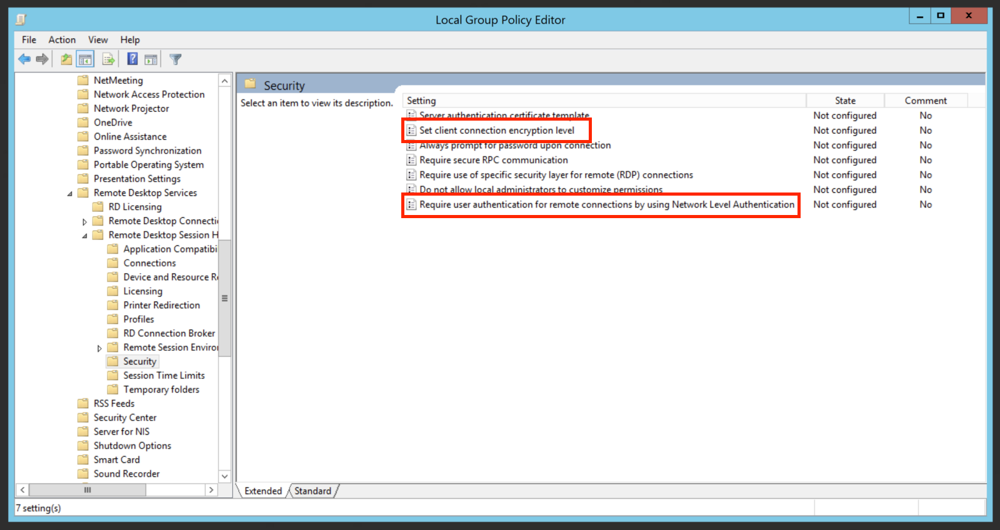
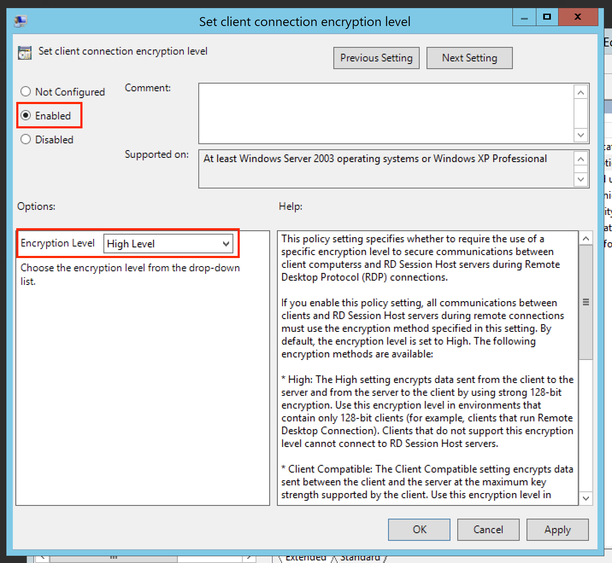
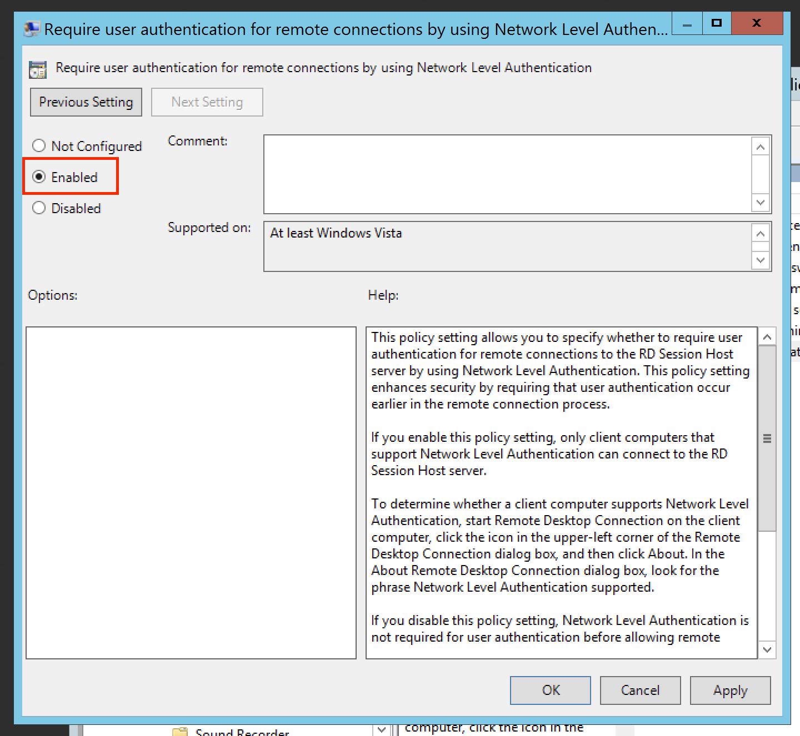

# รายละเอียด
การที่ฝั่ง client ไม่ได้มีการยืนยันตัวตนของ server แม้จะมีการ encryption แล้ว ทำให้ตัว attacker สามารถแทรกตัวเข้ามาสร้าง encryption ระหว่างตัว server และ client โดยที่ไม่มีการตรวจจับได้ ด้วยเหตุนี้ทำให้ attacker สามารถขโมยข้อมูลสำคัญได้ รวมไปถึงข้อมูลในการเข้าถึง server นั้นๆ
*****

# การตั้งค่า
สามารถตั้งค่า โดยการแก้ไขค่าใน Group Policies ของ Windows ดังขั้นตอนด้านล่างนี้

1. เปิดหน้าต่าง Local Group Policies โดยเปิดหน้าต่าง run พิม `gpedit.msc`

2. เมื่อทำการเปิดขึ้นมาแล้ว ให้ไปยังเมนู `Administrative Templates` -> `Windows Components` -> `Remote Desktop Services` -> `Remote Desktop Session Host` -> `Security` 

3. ในส่วนของ `Set Client Connection Encryption Level` ให้ทำการตั้งค่าเป็น `High Level` เพื่อทำการตั้งค่าการ encrypt ของ client ให้มีความซับซ้อนมากขึ้น

4. และในส่วนของ `Require user authentication for remote connections by using Network Level Authentication` ให้ทำการ `enabled` เพื่อให้ client ที่อยู่ใน network เดียวกันเท่านั้นที่จะทำการ to connect กับ server ได้ และในส่วนนี้จะทำการตั้งค่าหรือไม่ขึ้นอยู่กับความต้องการของผู้ใช้งานเอง

*****

# อ้างอิง

* https://www.tenable.com/plugins/nessus/18405
* https://pasedasnotes.com/microsoft-windows-remote-desktop-protocol-server-man-in-the-middle-weakness