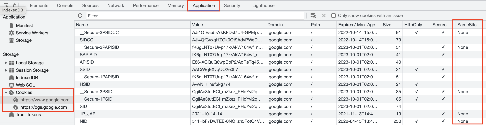
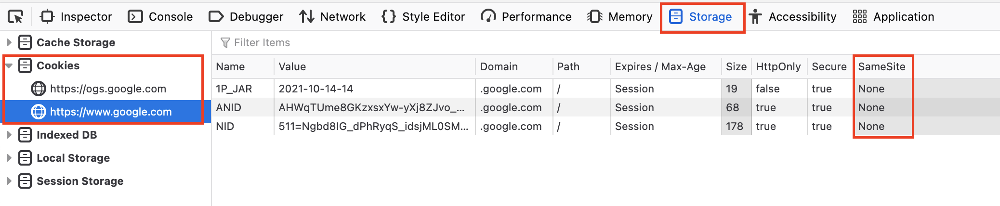

# รายละเอียด

Same-site cookie คือ ค่าที่กำหนดว่าจะให้มี Cookie อะไรที่จะสามารถโหลด Cookie จากไซต์เดียวกันหรือข้ามไซต์ได้เพื่อช่วยลดเรื่องการโจมตี Cross-site request forgery (CSRF) ได้ 
*****

# การตรวจสอบ

**Google Chrome**  สามารถเข้าไปตรวจสอบว่าค่า SameSite Cookies ถูกเปิดใช้งานหรือไม่ โดยการเปิดหน้าต่าง Developer Tools ขึ้นมาแล้วไปที่แท็บ Application เมนู Storage ตามด้วย Cookies เลือกโดเมนที่ต้องการตรวจสอบ

ในตารางฝั่งขวามีจะมี column ชื่อ SameSite อยู่ ให้ตรวจสอบค่า cookie ที่ต้องการ ว่าเปิดใช้งานเป็นแบบไหนอยู่ ซึ่งค่าที่สามารถกำหนดได้จะมี `Lax, Strict, None`



<br/>

**Firefox** สามารถเข้าไปตรวจสอบว่าค่า Samsite Cookies ถูกเปิดใช้งานหรือไม่ โดยการเปิดหน้าต่าง Web Developer Tools ขึ้นมาแล้วไปที่แท็บ Storage ตามด้วยเมนู Cookies เลือกโดเมนที่ต้องการตรวจสอบ

ในตารางฝั่งขวามีจะมี column ชื่อ SameSite อยู่ ให้ตรวจสอบค่า cookie ที่ต้องการ ว่าเปิดใช้งานเป็นแบบไหนอยู่ ซึ่งค่าที่สามารถกำหนดได้จะมี `Lax, Strict, None`



*****

# การตั้งค่า

ในการตั้งค่าให้ SameSite Cookies นั้นจะมีการกำหนดค่าอยู่ด้วยกัน 3 แบบคือ

* **Lax** (ยอมรับ Cookies จาก Website อื่นได้ ผ่าน HTTP GET เท่านั้น เช่นการคลิก link ที่ชี้มายัง website ต้นทาง เป็นต้น ค่า Lax จะถูกกำหนดเป็น Default ถ้าไม่มีการกำหนดค่าใด ๆ ก่อนหน้านี้)
* **Strict** (Cookies ต้องถูกส่งมาจากต้นทางที่เป็น website เดียวกันเท่านั้น)
* **None** (ยอมรับ Cookies จาก website อื่นได้ โดยไม่จำกัดรูปแบบการส่ง cookies)

**Internet Information Services (IIS)** สามารถเข้าไปตั้งค่าได้ที่ web.config โดยการเพิ่ม rule ของ rewrite ดังตัวอย่างด้านล่าง

```xml
<rewrite>
            <outboundRules>
                <rule name="AddSameSiteCookieFlag">
                    <match serverVariable="RESPONSE_Set-Cookie" pattern="^(.*)(CFID|CFTOKEN|JSESSIONID)(=.*)$" />
                    <action type="Rewrite" value="{R:0};SameSite=strict" />
                </rule>
            </outboundRules>
</rewrite>
```
<br/>

**Apache Server** สามารถเข้าไปตั้งค่าได้ที่ .htaccess โดยการเพิ่ม rule ของ rewrite ดังตัวอย่างด้านล่าง

```ini
RewriteEngine on
RewriteBase "/"
RewriteCond "%{HTTP_HOST}"       "^example\.org$" [NC]
RewriteRule "^(.*)"              "https://www.example.org/index.html" [R=301,L,QSA]
RewriteRule "^(.*)\.html$"       "index.php?nav=$1 [NC,L,QSA,CO=RewriteRule;03;https://www.example.org;30/;SameSite=None;Secure]
```
<br/>

*****

# อ้างอิง

* https://web.dev/samesite-cookies-explained/
* https://developer.mozilla.org/en-US/docs/Web/HTTP/Headers/Set-Cookie/SameSite
