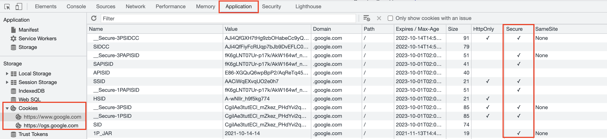

# รายละเอียด 

**Secure Flag** คือ ค่าที่กำหนดให้มีการตัว cookies ส่งผ่าน HTTPS เท่านั้น ซึ่งตัว cookies จะถูก encrypt ผ่าน SSL/TLS ทำให้การส่ง cookies ระหว่าง browser ของผู้ใช้และ server มีความปลอดภัย และทำให้เมื่อขโมย cookies ไปแล้วจะไม่สามารถอ่านข้อมูลของ cookies ได้ง่าย
*****

# การตรวจสอบ

**Google Chrome**  สามารถเข้าไปตรวจสอบว่าค่า Secure flag ถูกเปิดใช้งานหรือไม่ โดยการเปิดหน้าต่าง Developer Tools ขึ้นมาแล้วไปที่แท็บ Application เมนู Storage ตามด้วย Cookies เลือกโดเมนที่ต้องการตรวจสอบ

ในตารางฝั่งขวามีจะมี column ชื่อ Secure อยู่ ให้ตรวจสอบค่า cookie ที่ต้องการให้เปิดใช้งานว่ามีเครื่องหมายถูกหรือไม่ ถ้ามีอยู่แล้ว แสดงว่ามีการเปิดใช้งานแล้ว



<br/>

**Firefox** สามารถเข้าไปตรวจสอบว่าค่า Secure flag ถูกเปิดใช้งานหรือไม่ โดยการเปิดหน้าต่าง Web Developer Tools ขึ้นมาแล้วไปที่แท็บ Storage ตามด้วยเมนู Cookies เลือกโดเมนที่ต้องการตรวจสอบ

ในตารางฝั่งขวามีจะมี column ชื่อ Secure อยู่ ให้ตรวจสอบค่า cookie ที่ต้องการให้เปิดใช้งานว่ามีข้อความว่า `true` หรือไม่ ถ้ามีอยู่แล้ว แสดงว่ามีการเปิดใช้งานแล้ว


*****

# การตั้งค่า

**Internet Information Services (IIS)** สามารถเข้าไปตั้งค่าได้ที่ web.config ใน element ชื่อ httpCookies
```xml
<httpCookies requireSSL="true" />
```
<br/>

**PHP** สามารถเข้าไปตั้งค่าได้ใน php.ini ได้ ซึ่งให้ทำการเพิ่มค่าด้านล่างลงไปในไฟล์
```ini
session.cookie_secure = True
```
<br/>
*****

# อ้างอิง

* https://resources.infosecinstitute.com/topic/securing-cookies-httponly-secure-flags/
* https://owasp.org/www-community/controls/SecureCookieAttribute
